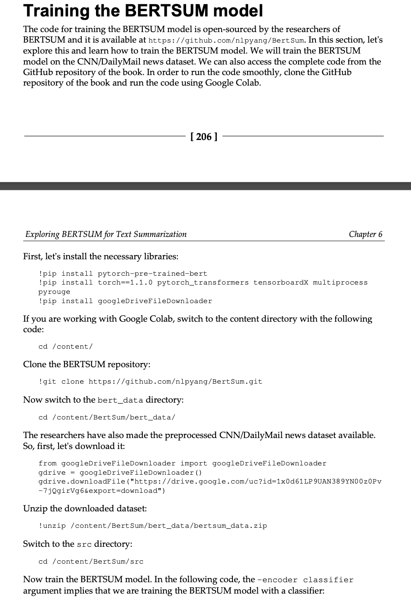

# Exploring BERTSUM for Text Summarization
The BERT model fine-tuned for the text summarization task is often called BERTSUM (BERT for summarization). 
針對文本摘要任務微調的 BERT 模型通常稱為 BERTSUM（BERT for summarization）。

我們將通過理解不同類型的文本摘要（稱為提取摘要和抽象摘要）來開始本章。 首先，我們將學習如何使用帶分類器的 BERTSUM、帶轉換器的 BERTSUM 和帶 LSTM 的 BERTSUM 執行提取摘要。 接下來，我們將研究 BERTSUM 如何用於執行抽象摘要任務。

`!python train.py -mode train -encoder classifier -dropout 0.1 -
   bert_data_path ../bert_data/cnndm -model_path ../models/bert_clas
   sifier -lr 2e-3 -visible_gpus 0 -gpu_ranks 0 -world_size 1 -report_every 50
   -save_checkpoint_steps 1000 -batch_size 3000 -decay_method noam -
   train_steps 50 -accum_count 2 -log_file ../logs/bert_classifier -
   use_interval true -warmup_steps 10000`